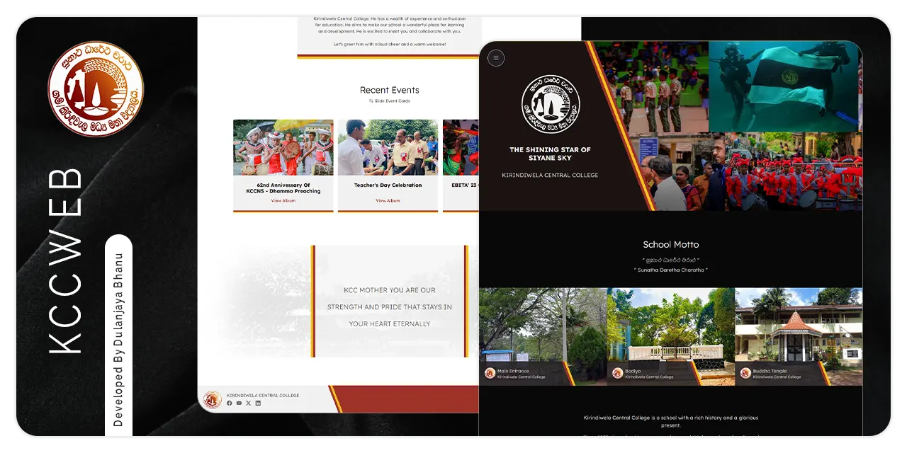

    

 

    <a href="https://kccn.netlify.app">Live Website</a> |
    <a href="https://github.com/dulanjayabhanu/KccWeb/discussions">Discussions</a>

 

    <strong>Official Website of Kirindiwela Central College - National School</strong>
     
    A modern, responsive, and user-friendly school website.

  

## What is This Project?

This is the official website of Kirindiwela Central College. It provides students, teachers, alumni, and the community with updated information about the school’s history, vision, achievements, and events.  

I am a proud alumnus of this school. I personally developed this project and gifted it to the school completely free of charge. No development cost, no hosting cost, no logo designing cost, and no maintenance cost.  

> This project is my way of giving back to the school that shaped me.

## Features

1. About the School
    - History since 1958  
    - Vision and Mission  
    - School motto and identity  

2. Principal’s Message  
    - A personal message from Principal of the school  

3. Events and Timeline  
    - 62nd Anniversary Celebration  
    - Teacher’s Day  
    - EBITA’23 Commerce Day  
    - Other important milestones  

4. Extra-Curricular Activities  
    - Sports achievements  
    - Clubs and societies  

5. Dark Mode Support  
    - Built-in theme toggle for improved accessibility  

6. Contact and Privacy  
    - Easy navigation to contact details and privacy policy  

## Tech Stack
- **Frontend**: HTML, CSS, JavaScript
- **Hosting**: Netlify
- **Design**: Custom logos, banners, and event imagery  

## Acknowledgments

Developed with 🧡 by me, an alumnus of Kirindiwela Central College

> Given as a free gift to the school that helped shape my life

## License

This project is licensed under the MIT [LICENSE](https://github.com/dulanjayabhanu/KccWeb/blob/main/LICENSE).
